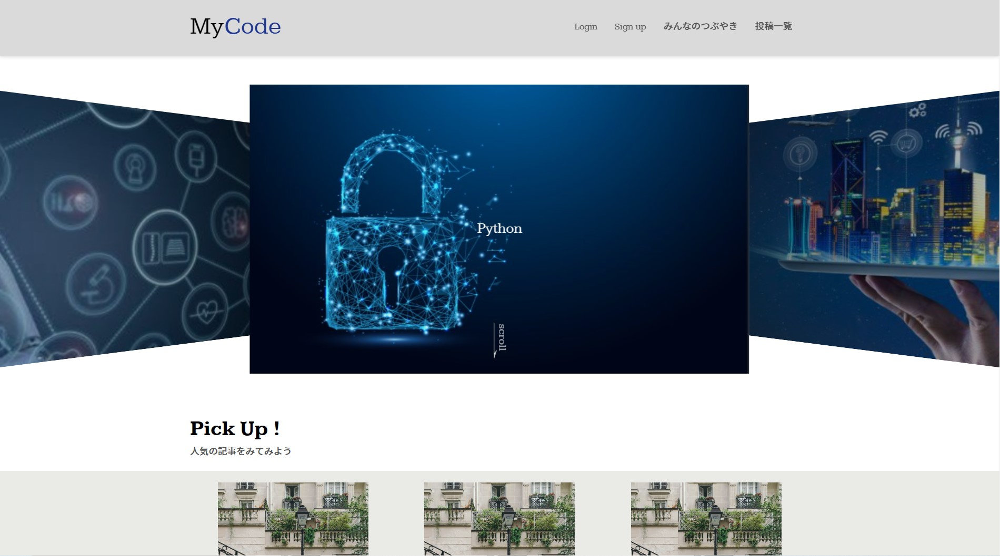
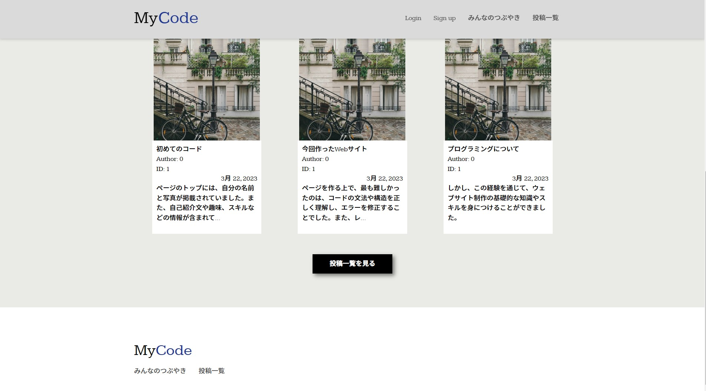
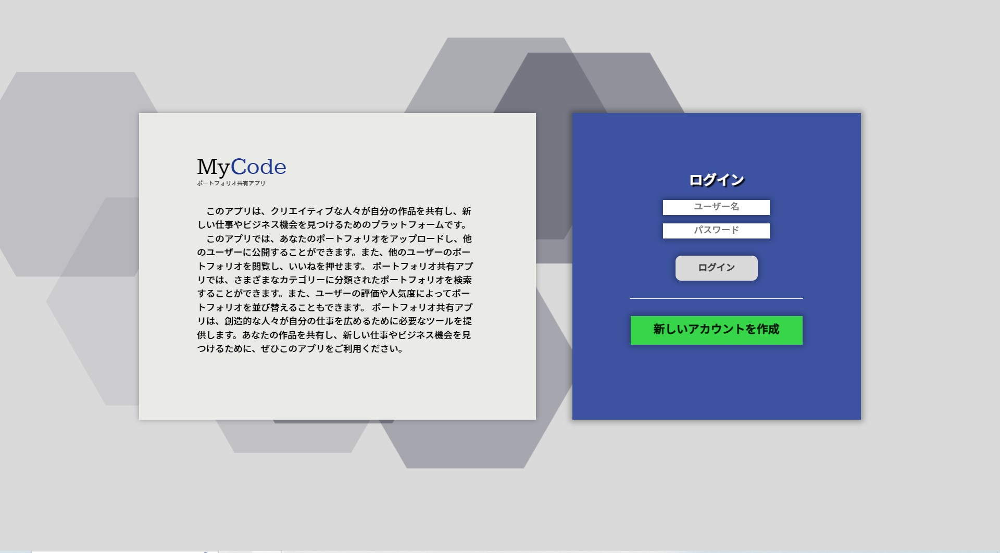
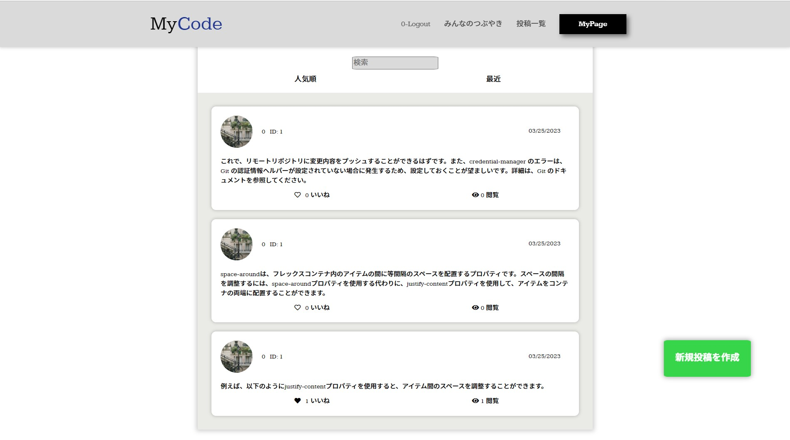
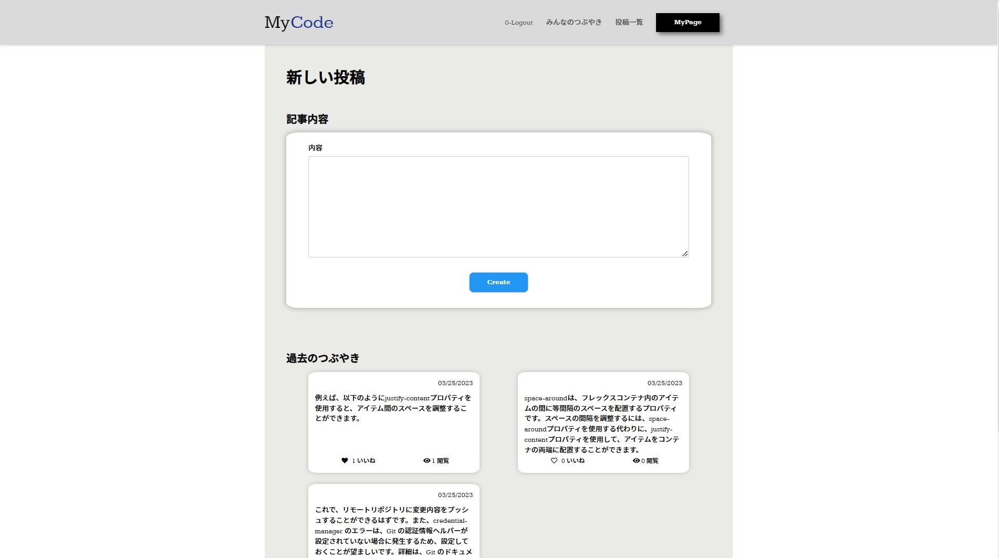
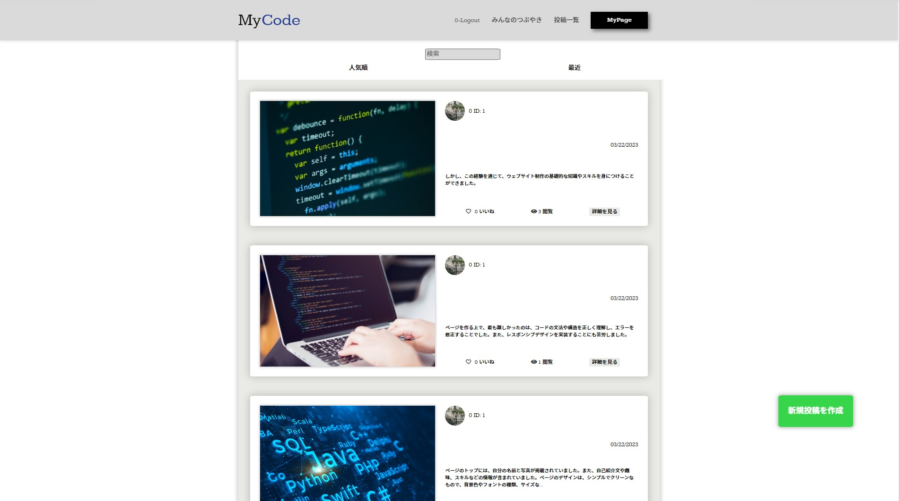
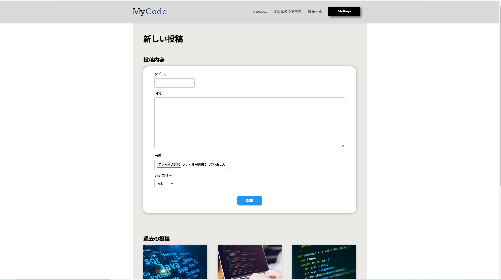
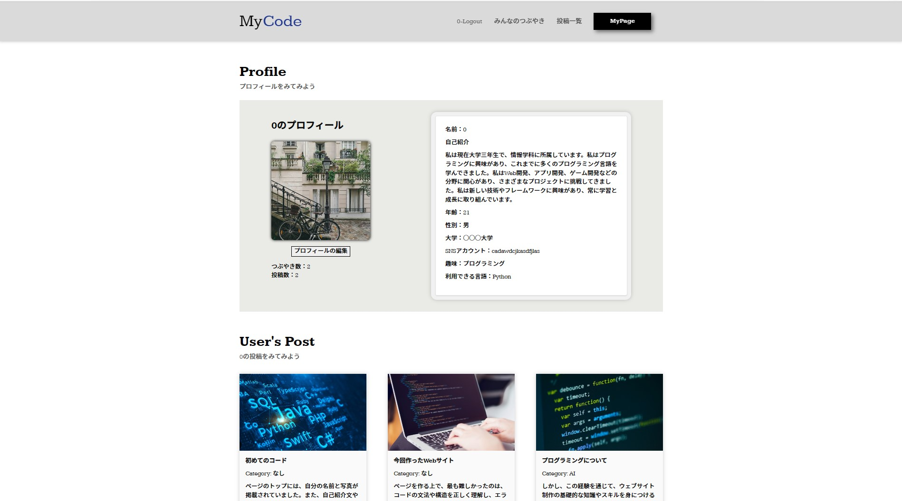
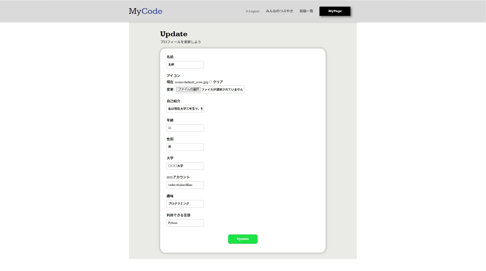

# MyCode

## 1. MyCodeとは?
MyCodeは、twitterとinstagramの機能を合わせたエンジニアのためのSNSです。

## 2. アプリ紹介

### 1. スタート画面

スタート画面ではヒーロースライダーを追加し、エンジニアに関わる画像を見れます。

pick up！の部分では、最近投稿された記事を見れます。

### 2. ログイン画面
[ログイン画面の動画](https://www.youtube.com/watch?v=uGMlsRFcqeo)

新しいアカウントを作成を押すとサインアップのモーダルウィンドウが表示されます。

### 3. トーク画面
[トーク画面の動画](https://www.youtube.com/watch?v=uGMlsRFcqeo)

トーク画面では全ユーザーが投稿したつぶやきを見れます。 
人気順、最近を押すと、つぶやきの順番が変更され、つぶやきにいいねを押せます。

トーク画面の新規投稿を作成ボタンを押すとつぶやき作成画面に遷移し、新しくつぶやきを作成出来ます。

### 4. ポスト画面
[ポスト画面の動画](https://www.youtube.com/watch?v=uGMlsRFcqeo)

ポスト画面では全ユーザーが画像付きで投稿できます。 
人気順、最近を押すと、投稿の順番が変更され、投稿にいいねを押せます。

ポスト画面の新規投稿を作成ボタンを押すとポスト作成画面に遷移し、新しく作成出来ます。

### 5. マイページ画面
[マイページ画面の動画](https://www.youtube.com/watch?v=uGMlsRFcqeo)

マイページ画面では自分のプロフィールの編集や過去の投稿を見れます。

マイページ画面の新プロフィールの編集ボタンを押すとアップデート画面に遷移し、自分のプロフィールを編集出来ます。
